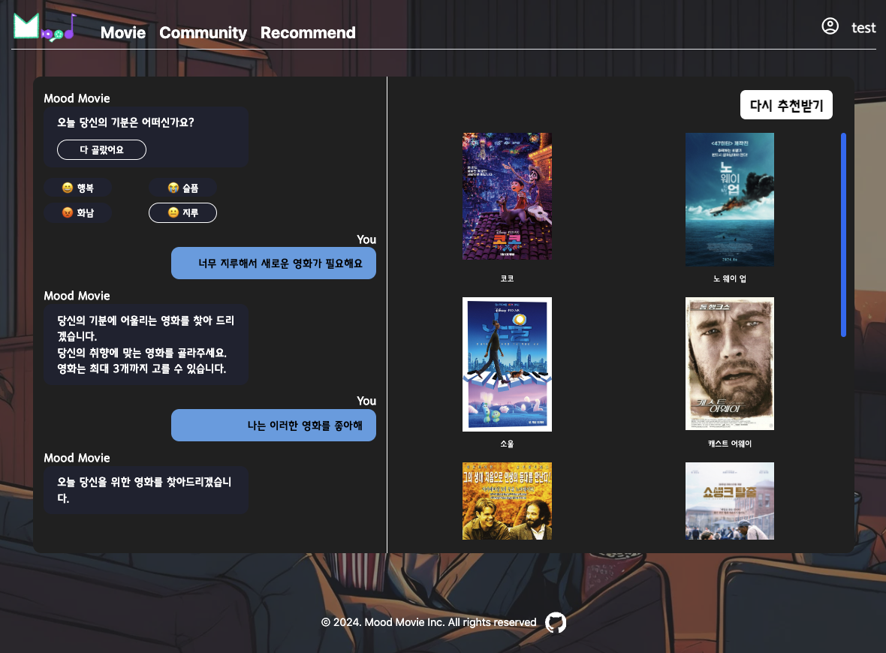

# 최종 관통프로젝트

## 과제 개요

### 목표

- 사용자의 오늘의 기분을 바탕으로 영화를 추천할 수 있는 사이트 개발
- 사용자들의 자유로운 이야기와 영화 리뷰를 남기기 위한 커뮤니티를 제공

### 서비스 구현 정도

- 로그인 / 회원가입
- 랜덤 영화 추천
- 커뮤니티
- 영화 상세 페이지
- 영화 리뷰 작성
- AI를 활용한 영화 추천
- 프로필

[진행상황 문서](frontEnd/docs/%20features/Readme.md)

### 개발 기간

- 2024-05-16 ~ 2024-05-23

## Teams

<table>
  <tr>
    <th style="text-align:center;"></th>
    <th style="text-align:center;">최홍석(팀장)</th>
    <th style="text-align:center;">최성철(조원)</th>
  </tr>
  <tr>
    <td align=center>GIT</td>
    <td align=center><a href='https://github.com/k-redstone'>@k-redstone</a></td>
    <td align=center><a href='https://github.com/CSchoice'>@CSchoice</a></td>
  <tr>
    <td align=center>업무분담</td>
    <td align=center> FrontEnd, Figma 디자인, </td>
    <td align=center>BackEnd, 데이터 모델링, </td>
  </tr>
  </tr>
  <tr>
    <td align=center>공통 작업</td>
    <td align=center colspan="2">아이디어 기획</td>
  </tr>
</table>

## TECH

### FrontEnd

  
  
  
  
  

### BackEnd

  
  

### Deploy

  
  

## 실행 환경

- Node : 20.12.0
- Vue : 3.4.21
- Python: 3.9
- Django: 4.2.8
- Django-Rest-Framework: 3.14.0

## 사용 방법

### FrontEnd

```javascript
npm i
npm run dev
```

### BackEnd

```python
# 가상환경은 선택 사항
python manage.py makemigrations
python manage.py migrate
python manage.py runserver

# 로드 데이터
python manage.py loaddata movies.json
```

## IA

- 

## 데이터 베이스 모델링(ERD)

- 

## 핵심 기능

- Chat GPT를 활용한 영화 추천
- 영화 리뷰를 통한 커뮤니티

## 영화 추천 알고리즘 상세 설명

### 추천 로직

- 

<br />

### 구현 코드

1. Fetch to GPT

```javascript
const fetchGpt = async (messages) => {
  const response = await openai.chat.completions.create({
    model: "gpt-4o",
    messages: messages,
    temperature: 0.85,
    max_tokens: 1000,
    response_format: { type: "json_object" },
  });
  return JSON.parse(response.choices[0].message["content"].trim());
};

// Default Prompt
const gptMessageList = ref([
  {
    role: "system",
    content: "You are an expert in recommending movies and Korean.",
  },
  { role: "user", content: "앞으로 답변은 한국어로 해줘" },
  {
    role: "user",
    content:
      "사용자가 입력한 감정을 해소할 수 있는 장르를 3개 추천해줘. (추천 장르는 보여주지 않아도 괜찮아)",
  },
  {
    role: "user",
    content:
      "앞에서 추천해준 장르별로 영화를 3개씩 추천해주고, 중복되지 않는 추가 추천 영화도 3개 추천해줘.",
  },
  { role: "user", content: "12개의 영화를 영화 제목만 리스트에 담아줘." },
  {
    role: "user",
    content:
      "추천된 영화를 하나의 json 형식 만들어줘. 예시는 {movies: 추천된 영화로 이루어진 리스트]",
  },
]);
```

<br />
2. 사용자가 고른 감정을 기반으로 Prompt를 넣어주고 응답 요청

```javascript
const setUserMood = async (mood) => {
  // 사용자의 기분을 메시지 리스트에 넣고 함수 호출
  gptMessageList.value.push({ role: "user", content: "슬퍼요" });
  fetchGptMood(chat.value);
};

const fetchGptMood = async (chat) => {
  // 저장되어 있는 메시지 리스트로 GPT에게 요청
  let gptResponse = await fetchGpt(gptMessageList.value);
  // 유저의 기분에 어울리는 영화  목록을 BackEnd로 fetch하여 영화 정보를 받아옴
  await store.fetchMoodMovie(gptResponse);
};
```

<br />
3. 사용자가 고른 영화를 기반으로 Prompt를 넣어주고 응답 요청

```javascript
const setUserSelectMovie = (movieList) => {
  // 사용자가 고른 영화 목록을 GPT 메시지 리스트에 넣어줌
  movieList.forEach((movie) => {
    gptMessageList.value.push({
      role: "user",
      content: `나는 영화 ${movie}를 좋아해 `,
    });
  });
  // 앞선 메시지 리스트를 기반으로 최종 영화 추천을 받을 수 있도록 GPT 메시지 리스트에 넣어줌
  gptMessageList.value.push({
    role: "user",
    content:
      "사용자가 입력한 영화와 비슷한 영화를 총 12개 추천해줘. 앞에서 추천해준 영화와 중복되지 않는 영화를 추천해줘.",
  });
  fetchGptMovie(chat.value);
};

const fetchGptMovie = async (chat) => {
  // 저장되어 있는 메시지 리스트로 GPT에게 요청
  let gptResponse = await fetchGpt(gptMessageList.value);
  // 최종 추천 목록을 BackEnd로 fetch하여 영화 정보를 받아옴
  await store.fetchMoodMovie(gptResponse);
};
```

## 서비스 구현 화면

> 회원가입


> 로그인


> AI기반 영화 추천



> 영화 랜덤 추천


> 영화 상세 페이지


> 커뮤니티


> 프로필


## API 명세서

[API 문서](./backEnd/docs/API.md)

## Git 컨벤션

[깃 컨벤션 문서](./docs/convention/GIT_CONVENTION.md)

## 프로젝트를 하면서 느낀점

### 배운점

- 최홍석: 와이어프레임의 작업 여부에 따라 개발 속도 및 효율성이 다르다는 것을 많이 느낄 수 있던 프로젝트였습니다. 뼈대만 작업을 하고 디테일 한 부분은 개발을 하면서 디자인을 하다보니 이미 만들어진 컴포넌트를 사용할 때 기능에 맞춰 수정해야 할 상황이 많이 생기게 되었습니다. 아이디어, 기획, 와이어프레임 등 손으로 코드를 작성하기 전 해야할 작업들이 튼튼하지 않으면 무너진다는 것을 알게 되었습니다. 그리고 서버로부터 데이터를 fetch 해올 때 비동기 요청을 보내게 되는데 try/catch문으로 어떻게 에러 핸들링 할지 고민을 하면서 비동기 로직에 대해 더욱 알게 되었습니다.

- 최성철: Github를 이용하여 협력을 하며, commit을 작성하니, 팀원에게 작업 상황을 직접 말해주지 않아도 진행 상황을 전할 수 있다는 것을 알았습니다. 그래서 더욱 commit 작업 단위로 자세히 찍어야 한다는 것을 배웠습니다. 또한 Backend와 Fondend의 경계에 대하여 확실하게 알게 되었고, 서로의 작업을 원활하게 진행하기 위하여 어떤 것을 알려주고, 요청해야 하는 것에 대해 잘 배울 수 있는 프로젝트였습니다.

### 아쉬운점

- 최홍석: 목표로 한 기능은 모두 구현을 했지만, 각 기능들이 더 고도화될 수 있었는데 시간이 부족해 작업하지 못한 것이 아쉬웠습니다. 그리고 2명이서 작업을 하다보니 협업 툴로 노션과 MatterMost로 작업 내용을 공유하거나 이야기를 나누었는데, Jira와 Trello와 같은 툴로 2학기를 대비해 사용해보고 싶었는데, 사용법을 몰라 짧은 시간내 익히고 적응하는 데 시간이 빠듯할 것 같아 사용하지 못했었습니다. 마지막으로 프로젝트 마감이 다가올수록 함수나 컴포넌트의 재사용성을 신경쓰지 않고 하드코딩으로 작성한 것이 꽤 있는데, 재사용성이 높은 코드를 작성하는게 습관화될 수 있도록 노력해야겠다는 생각이 들었습니다.
- 최성철: 프로젝트를 끝내고 나니, 기능은 기획을 한 대로 구현되었지만 모델 설계, url, view함수 등은 수정이 생기는 부분이 많았습니다. 기획 단계에서 Backend 구조에 대해 아직 미흡했습니다.
  Django에서 class기반과 def 기반 views 작성이 가능하지만 저는 def 기반으로 작성하여서 같은 기능을 사용하는 부분도 재사용이 힘들었습니다. Class방식의 개발도 공부해야겠다는 생각이 들었습니다.
  기본 Django 외 개발을 도와줄 여러 라이브러리가 있었지만 이런 라이브러리들을 잘 활용하지 못하고 기본적인 사용만 하였습니다. 개발을 도와줄 수 있는 다양한 도구들에 대해서도 공부가 필요하다고 생각했습니다.

## 배포

- 배포용 코드는 환경변수 처리와 빌드를 위해 제출된 코드와 상이함이 있습니다.

### 구성도

- 

### 사이트

- https://tmoodmovie.vercel.app/
